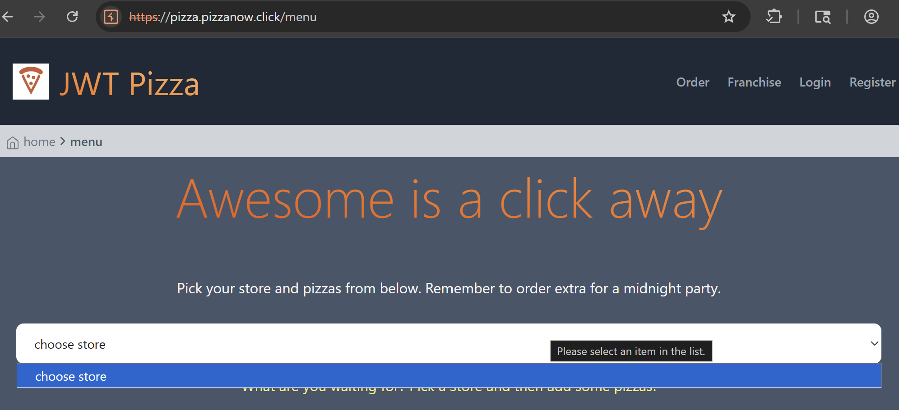
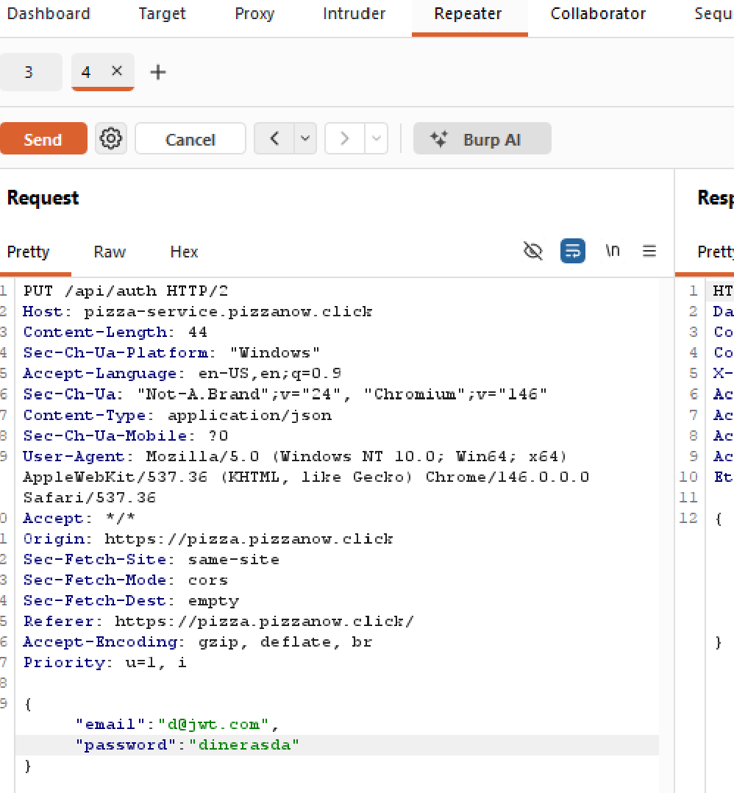
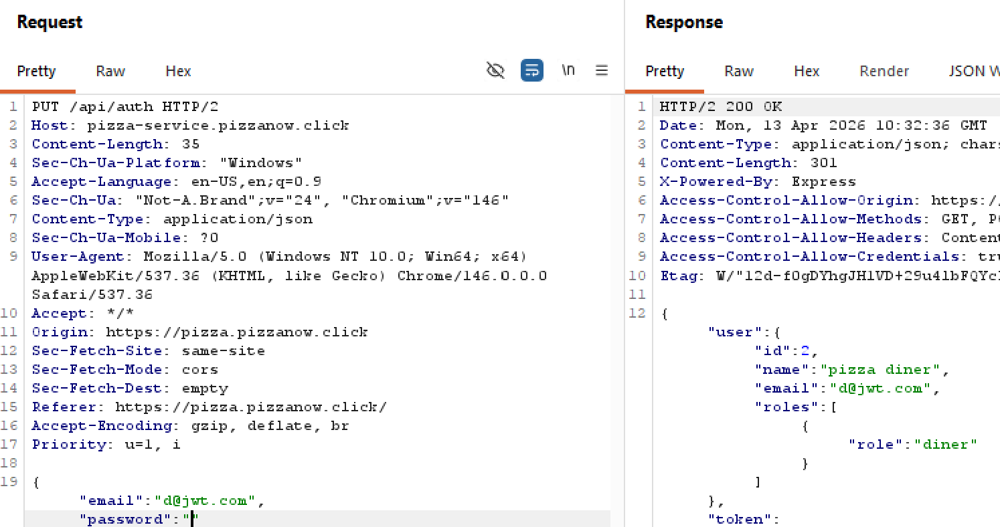
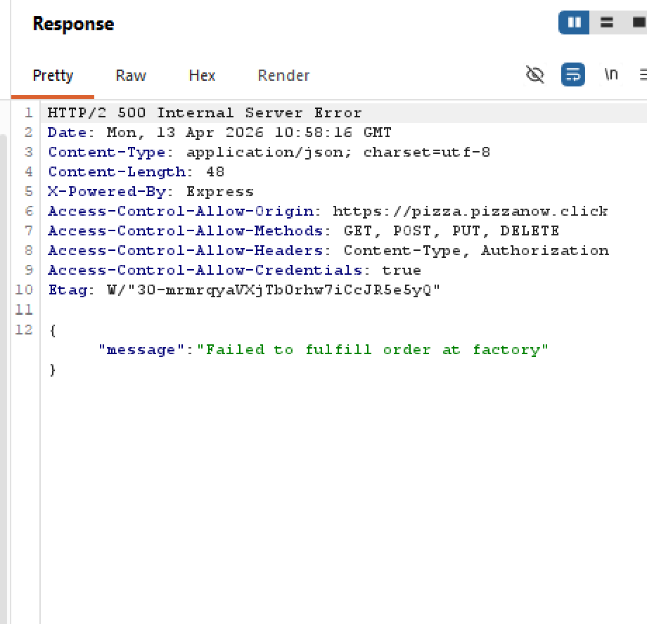
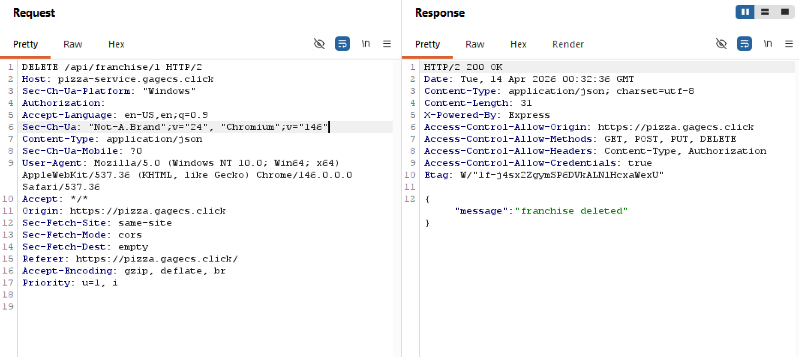
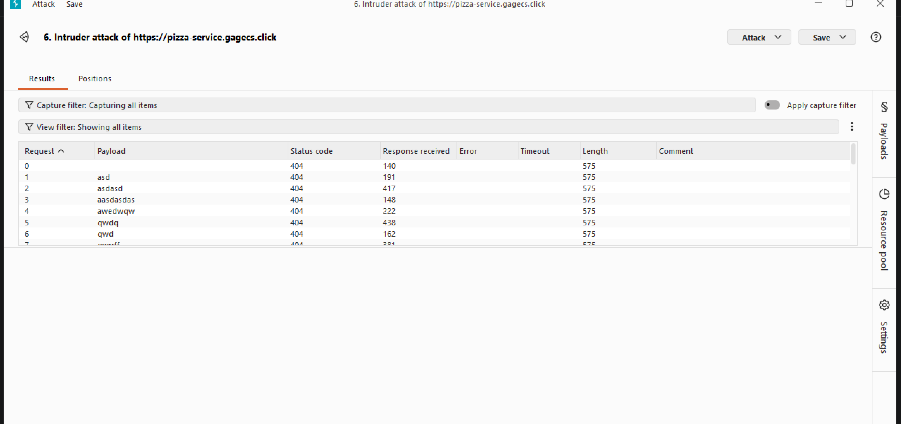
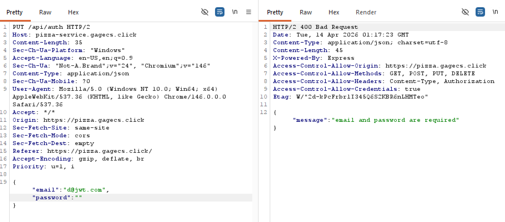
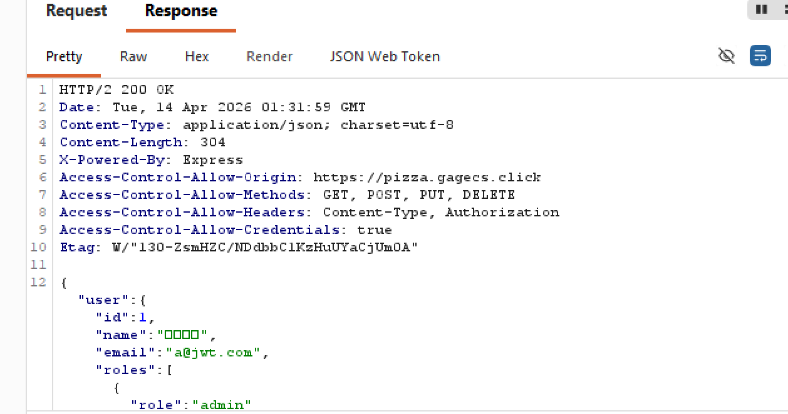
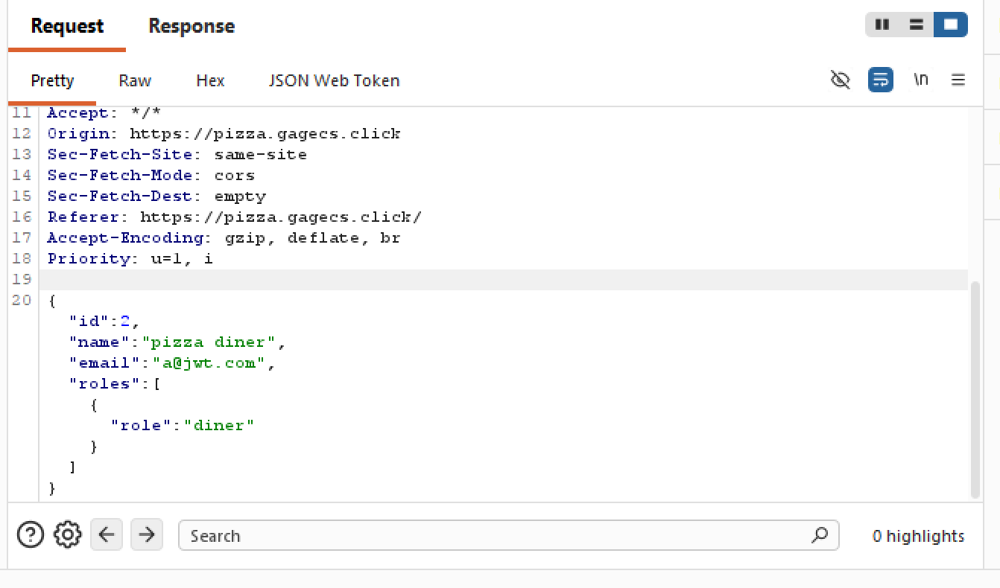
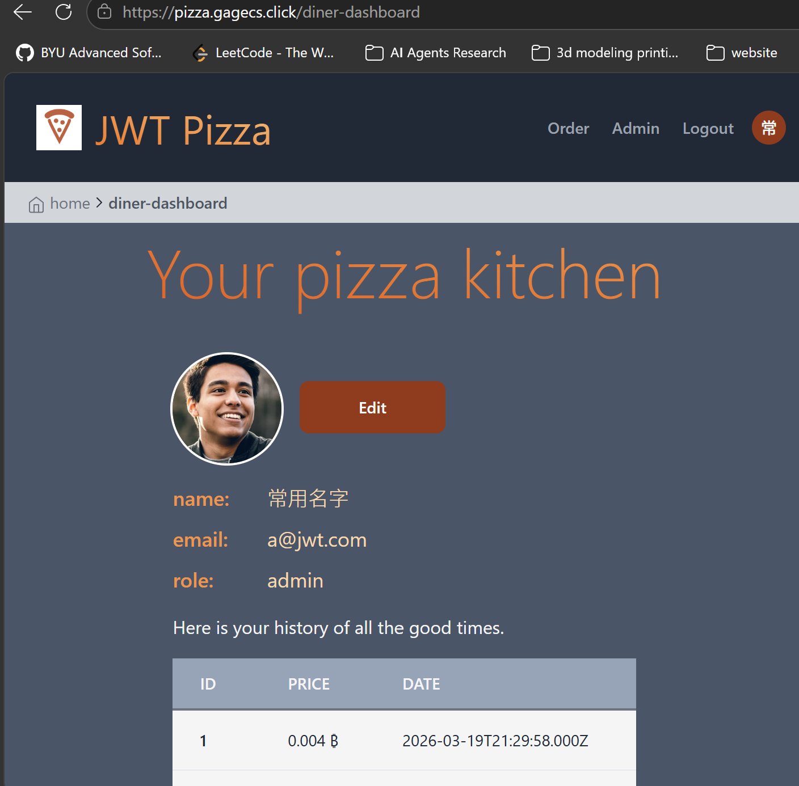

# Deliverable 12: Penetration Testing

## Self Attacks

### Gage Attack 1

| Item           | Result                                                                         |
| -------------- | ------------------------------------------------------------------------------ |
| Date           | April 9, 2026                                                                  |
| Target         | pizza.gagecs.click                                                             |
| Classification | Broken Access Control                                                          |
| Severity       | 3                                                                              |
| Description    | Can login to any account, including admin, by leaving the password as empty string. Sensitive data can be accessed.     |
| Images         |        By editing the http request, a user can log in as an admin. |
| Corrections    | Enforce password to not be empty string.                                       |

### Gage Attack 2

| Item           | Result                                                                         |
| -------------- | ------------------------------------------------------------------------------ |
| Date           | April 9, 2026                                                                  |
| Target         | pizza.gagecs.click                                                             |
| Classification | Insecure Design                                                                |
| Severity       | 3                                                                              |
| Description    | The price can be modified in HTTP request to be whatever the user desires, inevitably leading to loss of revenue.     |
| Images         |    Price has been modified to give free pizza. |
| Corrections    | Check price before making call to pizza factory                                |

### Gage Attack 3

| Item           | Result                                                                         |
| -------------- | ------------------------------------------------------------------------------ |
| Date           | April 9, 2026                                                                  |
| Target         | pizza.gagecs.click                                                             |
| Classification | Injection                                                                      |
| Severity       | 0                                                                              |
| Description    | SQL injection was attempted in multiple places, however none of them were able to cause anything unintended.   It's possible I was doing injection wrong, however.    |
| Images         |    SQL injection unable to cause harm. |
| Corrections    | No changes are necessary at the moment.                                        |

### Gage Attack 4

| Item           | Result                                                                         |
| -------------- | ------------------------------------------------------------------------------ |
| Date           | April 9, 2026                                                                  |
| Target         | pizza.gagecs.click                                                             |
| Classification | Security Misconfiguration                                                      |
| Severity       | 3                                                                              |
| Description    | The password to the admin account is 'admin', which is well known and easily guessed. This can give access to a large amount of sensitive data.    |
| Images         |    Leaving default credentials gives admin access to anyone that finds the easily accessed credentials.  |
| Corrections    | Change default admin credentials.                                        |

### Gage Attack 5

| Item           | Result                                                                         |
| -------------- | ------------------------------------------------------------------------------ |
| Date           | April 10, 2026                                                                  |
| Target         | pizza.gagecs.click                                                             |
| Classification | Security Misconfiguration                                                      |
| Severity       | 2                                                                              |
| Description    | The way authtokens are generated is not very random, which can be exploited.    |
| Images         |    The significance level is about 0, meaning the tokens are not randomly generated.  |
| Corrections    | Change authtoken generation to be random.                                        |

## Self Attack Travis
Target: https://pizza.pizzanow.click/

### Travis Attack 1
Item | Result
--- | --- 
Date | 4/10/26
Target website | https://pizza.pizzanow.click/
Classification | Broken Access Control (OWASP A01)
Severity (0-4) | 4
Description of result | I sent `DELETE /api/franchise/1 HTTP/2` with no token. The API still deleted the franchise. This means anyone can delete data without login.
Images | 
Corrections | Added `authRouter.authenticateToken` and admin/owner role check to franchise delete route. Retested and got `401` or `403`.

### Travis Attack 2
Item | Result
--- | ---
Date | 4/10/26
Target website | https://pizza.pizzanow.click/
Classification | Identification and Authentication Failures (OWASP A07)
Severity (0-4) | 2
Description of result | Login endpoint had no rate limiting. I used Burp Intruder for repeated login attempts. Requests were not blocked.
Images | 
Corrections | Added rate limit middleware on auth routes (register/login). Retested and got `429 Too Many Requests` after limit.

### Travis Attack 3
Item | Result
--- | ---
Date | 4/13/26
Target website | https://pizza.pizzanow.click/
Classification | Identification and Authentication Failures (OWASP A07)
Severity (0-4) | 1
Description of result | Login did not properly validate missing credentials. I tested login requests with missing `email` or missing `password` and the endpoint behavior was not correctly handled.
Images | 
Corrections | Added login input validation so both `email` and `password` are required. The endpoint now returns `400` with `email and password are required` when either field is missing.

### Travis Attack 4
Item | Result
--- | ---
Date | 4/10/26
Target website | https://pizza.pizzanow.click/
Classification | Insecure Design (OWASP A04)
Severity (0-4) | 1
Description of result | Sent order request with empty `items` array. Service behavior was unstable and could impact performance.
Images | 
Corrections | Added validation to require at least one item before creating order.

### Travis Attack 5
Item | Result
--- | ---
Date | 4/10/26
Target website | https://pizza.pizzanow.click/
Classification | Identification and Authentication Failures (OWASP A07)
Severity (0-4) | 3
Description of result | JWT token had no expiration. I logged in once and reused the same token later. It still worked.
Images |
Corrections | Changed token signing to include expiration (`expiresIn`, example: `24h`). Retested old token after expiration and got unauthorized.

### Travis Attack 6
Item | Result
--- | ---
Date | 4/13/26
Target website | https://pizza.pizzanow.click/
Classification | Insecure Design (OWASP A04)
Severity (0-4) | 3
Description of result | I sent `POST /api/order` with a valid `menuId` but changed item `price` in the request body. The service trusted client input, so order totals and revenue could be manipulated.
Images | Did in Class
Corrections | Updated order creation to derive item price/description server-side from menu data by `menuId` and ignore client-supplied values. Added validation for unknown menu items and now return `400` for invalid menu IDs. Added regression tests to verify tampered prices are not accepted.

## Peer Attacks

### Gage Attack on Travis 1
| Item           | Result                                                                         |
| -------------- | ------------------------------------------------------------------------------ |
| Date           | April 13, 2026                                                                  |
| Target         | pizza.pizzanow.click                                                             |
| Classification | Security Misconfiguration                                                      |
| Severity       | 0 (higher if logins are blocked for every user after 4+ failed attempts in a row by one person)                                                                              |
| Description    | Admin account email and password were attempted to be brute forced through by guessing default and common credentials. I was unsuccessful gaining admin access this way. However, after enough failed login attempts the site began blocking all login attempts, which could be problematic for other users trying to login. If the block is based on IP address, however, there is no problem for other users. The block was lifted after a few minutes.    |
| Images         |    Admin account unable to be brute forced through. After enough failed logins, the site blocks all login requests for a period of time.  |
| Corrections    | If every login is blocked, this needs to be corrected so other users are not punished.                                                                           |

### Gage Attack on Travis 2

| Item           | Result                                                                         |
| -------------- | ------------------------------------------------------------------------------ |
| Date           | April 13, 2026                                                                  |
| Target         | pizza.pizzanow.click                                                             |
| Classification | Broken Access Control                                                          |
| Severity       | 0                                                                              |
| Description    | Attempted to login by leaving the password as empty string. This bug was fixed, and no access was gained.     |
| Images         |    By editing the http request, a user cannot bypass the password. |
| Corrections    | None                                       |

### Gage Attack on Travis 3

| Item           | Result                                                                         |
| -------------- | ------------------------------------------------------------------------------ |
| Date           | April 13, 2026                                                                  |
| Target         | pizza.pizzanow.click                                                             |
| Classification | Insecure Design                                                                |
| Severity       | 0                                                                              |
| Description    | Attempted to modify the price in HTTP request to be free, but the site charged regular price anyways.     |
| Images         |    Price stays the same despite modified HTTP request. |
| Corrections    | None                                                                           |

### Gage Attack on Travis 4

| Item           | Result                                                                         |
| -------------- | ------------------------------------------------------------------------------ |
| Date           | April 13, 2026                                                                  |
| Target         | pizza.pizzanow.click                                                             |
| Classification | Security Misconfiguration                                                      |
| Severity       | 2                                                                              |
| Description    | The default credentials for the franchisee account were untouched, allowing easy access for a hacker to delete stores, create stores, etc.     |
| Images         |    Leaving default credentials gives franchisee access to anyone that finds the easily accessed credentials.  |
| Corrections    | Change default franchisee credentials.                                        |

### Gage Attack on Travis 5

| Item           | Result                                                                         |
| -------------- | ------------------------------------------------------------------------------ |
| Date           | April 13, 2026                                                                  |
| Target         | pizza.pizzanow.click                                                             |
| Classification | Injection                                                                      |
| Severity       | 0                                                                              |
| Description    | SQL injection was attempted in multiple places, however none of them were able to cause anything unintended.    |
| Images         |    SQL injection unable to cause harm. |
| Corrections    | None                                                                           |

## Travis Attack on Gage(Assigned Deployment)
Target: https://pizza.gagecs.click/

### Travis Attack on Gage 1
Item | Result
--- | --- 
Date | 4/13/26
Target website | https://pizza.gagecs.click
Classification | Broken Access Control (OWASP A01)
Severity (0-4) | 4
Description of result | I sent `DELETE /api/franchise/1 HTTP/2` with no token. The API still deleted the franchise. This means anyone can delete data without login.
Images | 
Corrections | You shpuld `authRouter.authenticateToken` and admin/owner role check to franchise delete route. Retested and got `401` or `403`.

### Travis Attack on Gage 2
Item | Result
--- | ---
Date | 4/13/26
Target website | https://pizza.gagecs.click
Classification | Identification and Authentication Failures (OWASP A07)
Severity (0-4) | 2
Description of result | Login endpoint had no rate limiting. I used Burp Intruder for repeated login attempts. Requests were not blocked.
Images | 
Corrections | Probably should add rate limit middleware on auth routes (register/login) to avoid password list attempts or target ddos. I already new the password since it was the one we previously used for that user.

### Travis Attack on Gage 3
Item | Result
--- | ---
Date | 4/13/26
Target website | https://pizza.pizzanow.click/
Classification | Identification and Authentication Failures (OWASP A07)
Severity (0-4) | 0
Description of result | Didn't allow me to login without specifying a password or email for the request attempt! Great Job!
Images | 
Corrections | No fixes needed since you already made the fix for this and my attack was unsucesfull!

### Travis Attack on Gage 4
Item | Result
--- | ---
Date | April 14, 2026
Target website | https://pizza-service.gagecs.click
Classification | OWASP A01:2021 - Broken Access Control
Severity (0-4) | 4
Description of result | Exploited an IDOR vulnerability to update a diner account's email to the admin's email address via PUT /api/user/2. The server responded with a valid admin JWT token, granting full admin privileges to an unprivileged user. I was then able to edit the admin password and use all full admin privileges.
Images | 

Corrections | You should validate that the new updated email is unique and not already claimed by a user and make sure authorize update against authorized user only. 

### Travis Attack on Gage 5
Item | Result
--- | ---
Date | 4/13/26
Target website | https://pizza-service.gagecs.click
Classification | Insecure Design (OWASP A04)
Severity (0-4) | 0
Description of result | I attempted to send `POST /api/order` with a valid `menuId` but changed item `price` in the request body. The service trusted client input, so order totals and revenue could be manipulated.
Corrections | No fix needed as it was unsucesfull and already fixed. Great job!

## Summary of Learnings

Gage:  
I thought it was really cool to learn about the tools you can use to test for vulnerabilities, I had never heard of burp suite before. As someone who had only a very basic knowledge of cyber attacks and cybersecurity, I found this deliverable to be very useful and interesting. I'll be able to write better, more secure applications in the future with this knowledge. For example, don't use any sort of default credentials that can be easily guessed, sanitize any input from HTTP requests to avoid unintended consequences, etc. This was one of my favorite deliverables in the class.

Travis:  
Honestly using burpsuite was super cool. I really enjoyed this deliverable. It helped me to think way more security minded in how I design my applications as I realized I've probably been leaving way more flaws in the security then I realized before in my personal projects. I had a blast doing the pen testing and honestly I could see myself wanting to learn more about this and potentially doing it as a career. Intercepting the requests was a big learning and I realized how important it is to have a source of truth server side so that client side edits can't affect the application.